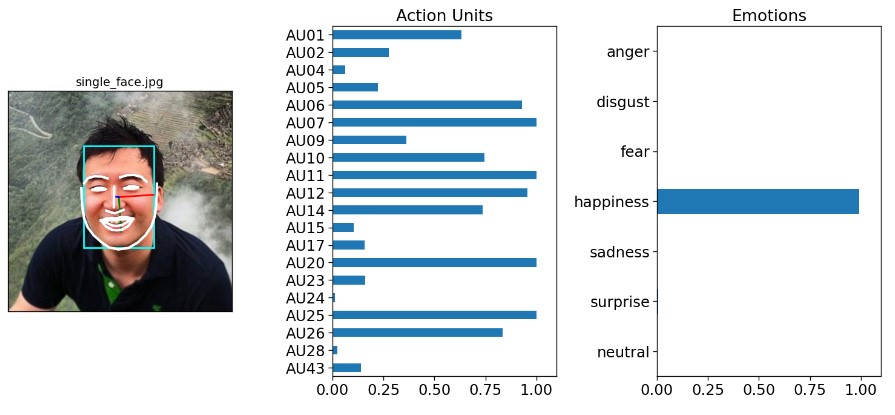

# Face Expression Detection with py-feat 

This repository contains a simple Python script for face detection using the py-feat library. The script demonstrates how to use various models for face detection, Action Unit (AU) analysis, emotion detection, and face pose estimation.

## Getting Started

1. Install the feat library. You can find installation instructions [here](https://py-feat.org/pages/installation.html).

2. Clone this repository or create a new Python script.

3. Run the script in your preferred Python environment (for convenience I use jupyter notebbok via anaconda navigator).

## Usage

The script performs the following tasks:

- Initializes a face detection system using the feat library.
- Detects faces in a single image and visualizes the results.
- Accesses various attributes of the detection, including face bounding boxes, Action Units, emotions, and face pose.
- Saves the results to a CSV file.
- Reads the saved data from the CSV file.
- Generates visualizations of the face detections in both single and multiple face images.

## Acknowledgments

- [py-feat](https://py-feat.org/pages/intro.html): The library used for face detection and analysis.
- [Facial Expressions](https://www.youtube.com/watch?v=TrgNKGjSyxA): Sample facial expressions
- [ChatGPT](https://openai.com/chatgpt): For AI-assisted troubleshooting/debugging, and also for possible comments for the code lines in this repository.

